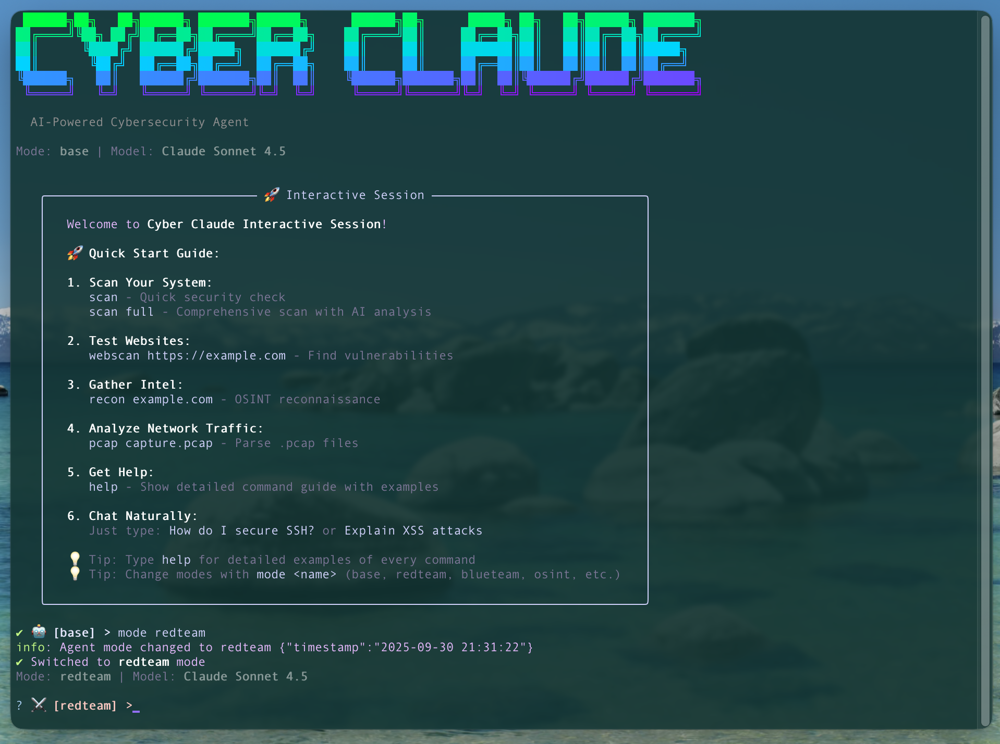

# 🛡️ Cyber Claude

**AI-Powered Defensive Cybersecurity Agent with Guided Workflows**

<p align="center">
  
</p>

**Perfect for Beginners & Security Professionals**

An AI-powered cybersecurity agent built with the [Claude Agent SDK](https://docs.claude.com/en/api/agent-sdk/overview), designed exclusively for **defensive security operations**. Features 10 pre-configured workflows for guided security tasks, web application vulnerability testing, OSINT reconnaissance, network traffic analysis (pcap), system hardening, and AI-powered security analysis.

**🎯 NEW: Guided Workflows** - Step-by-step security tasks perfect for learning and fast execution!
**🔒 Defensive-Only** - No exploitation, credential harvesting, or offensive capabilities
**🤖 AI-Powered** - Uses Claude and Gemini models for intelligent security analysis


---

## 🚀 Getting Started (60 seconds!)

```bash
# 1. Install
npm install

# 2. Configure (add your API key)
cp .env.example .env
# Edit .env and add ANTHROPIC_API_KEY or GOOGLE_API_KEY

# 3. Build
npm run build

# 4. Start with guided workflows!
cyber-claude flows

# Choose "Quick Security Health Check" (2-3 min)
# AI will scan your system and give you recommendations
```

**First time?** Try the **"Quick Security Health Check"** workflow - it's the fastest way to see what Cyber Claude can do!

---

## 📖 Documentation

### User Guides
- **[Complete Workflows & Playbook Guide](docs/WORKFLOWS.md)** - Comprehensive guide to getting the most out of Cyber Claude
- **[Agent Modes Guide](docs/AGENT_MODES.md)** - Detailed guide to using different agent modes effectively
- **[Quick Start Guide](docs/QUICKSTART.md)** - Fast track to getting started
- **[Security Policy](docs/SECURITY.md)** - Security reporting and best practices

### Technical Documentation
- **[Technical Architecture](docs/CLAUDE.md)** - Architecture, development, and implementation details
- **[Project Structure](docs/PROJECT_STRUCTURE.md)** - Codebase organization and file structure
- **[Professional Enhancements](docs/PROFESSIONAL_ENHANCEMENTS.md)** - IOC extraction, MITRE ATT&CK mapping, evidence preservation
- **[Project Assessment](docs/PROJECT_AUDIT.md)** - Independent security audit and assessment

### Version History
- **[Changelog](docs/CHANGELOG.md)** - Version history and release notes
- **[Capabilities Overview](docs/CAPABILITIES.md)** - Complete feature list and capabilities matrix

---

## 🆕 What's New

### v0.5.1 - Workflows & Enhanced User Experience

**🎯 NEW: Pre-Configured Workflows - Perfect for Beginners!**

The new `flows` command provides guided, step-by-step workflows for common security tasks:

```bash
cyber-claude flows                        # Interactive menu
cyber-claude flows --category security    # Show security workflows
cyber-claude flows --difficulty beginner  # Beginner-friendly workflows
```

**10 Pre-Built Workflows:**
- 🛡️  **Quick Security Health Check** (2-3 min, beginner) - Desktop security scan
- 🌐 **Website Security Audit** (3-5 min, beginner) - OWASP Top 10 assessment
- 🔍 **Domain Intelligence Gathering** (3-5 min, beginner) - Full OSINT scan
- 🚨 **Incident Response Triage** (5-7 min, intermediate) - Security incident analysis
- 📡 **Network Traffic Threat Hunting** (4-6 min, intermediate) - PCAP analysis
- 🕵️  **Full OSINT Investigation** (5-10 min, intermediate) - Deep reconnaissance
- 🔒 **System Hardening Guide** (10-15 min, intermediate) - Security improvements
- 🎯 **Red Team Reconnaissance** (10-15 min, advanced) - External recon
- 🚩 **CTF Web Challenge Solver** (10-20 min, advanced) - CTF assistance
- 📚 **Learn OSINT Basics** (15-20 min, beginner) - Interactive tutorial

**Why Workflows?**
- 🎓 **Beginner-Friendly**: Guided step-by-step experiences
- ⚡ **Fast**: Pre-configured for common tasks
- 📖 **Educational**: Learn security concepts while using them
- 🎯 **Goal-Oriented**: Each workflow solves a specific problem

### v0.5.0 - OSINT Reconnaissance Suite

**🔍 NO API KEYS REQUIRED!**

- **📡 10 Comprehensive OSINT Tools**: All free, no API keys needed!
  ```bash
  # Full reconnaissance
  cyber-claude recon example.com --full

  # Domain-focused scan
  cyber-claude recon example.com --domain

  # Username enumeration
  cyber-claude recon john_doe --person

  # Individual tools
  cyber-claude recon subdomains example.com
  cyber-claude recon breach user@example.com
  cyber-claude recon tech https://example.com
  cyber-claude recon username john_doe
  ```

- **🛠️ Included Tools** (All FREE):
  - **DNS Reconnaissance** - A/AAAA/MX/NS/TXT/SOA records, reverse DNS
  - **WHOIS Lookup** - Domain registration, age, expiration analysis
  - **Subdomain Enumeration** - Certificate transparency + DNS brute force
  - **Email Harvesting** - Website scraping + common patterns
  - **Username Enumeration** - 35+ platforms (GitHub, Twitter, Instagram, etc.)
  - **Breach Data Lookup** - Have I Been Pwned integration
  - **Technology Detection** - Web server, CMS, frameworks (50+ signatures)
  - **Wayback Machine** - Historical snapshots and domain history
  - **IP Geolocation** - Country/city/ISP lookup
  - **Reverse IP Lookup** - Find other domains on same IP

- **🎯 Professional Features**:
  - Risk scoring and assessment
  - Attack surface identification
  - Data exposure analysis
  - Export to JSON/Markdown
  - No rate limits (free tier APIs)
  - Privacy-respecting (passive only)

**Previous: v0.4.0 - Professional Security Tool Integration - MCP Powered!**

- **⚡ 9 Professional Security Tools**: Integrated via Model Context Protocol (MCP)
  ```bash
  # Web Security
  cyber-claude webscan https://example.com --nuclei --sslscan --sqlmap
  cyber-claude webscan https://example.com --with-mcp  # Run all tools

  # Network Security
  cyber-claude scan --network --nmap --target 192.168.1.0/24
  ```

- **🛠️ Included Tools**:
  - **Nuclei** - 5000+ vulnerability templates
  - **SSLScan** - SSL/TLS security grading
  - **SQLmap** - SQL injection testing
  - **Nmap** - Network port scanning
  - **Httpx** - HTTP probing & tech detection
  - **Katana** - Web crawler with JS parsing
  - **Amass** - Subdomain enumeration
  - **Masscan** - Ultra-fast port scanning
  - **HTTP Headers** - Security header analysis

- **🎯 Professional Features**:
  - IOC extraction with STIX 2.1 export
  - MITRE ATT&CK technique mapping
  - Evidence preservation with chain of custody
  - Triple hash verification (MD5/SHA1/SHA256)
  - Forensically sound metadata tracking

**📦 Network Traffic Analysis - AI-Powered Wireshark!**

- **🔍 PCAP Analysis**: Analyze network capture files with AI-powered insights!
  ```bash
  cyber-claude pcap capture.pcap --extract-iocs --mitre
  cyber-claude pcap --mode threat-hunt suspicious.pcap --preserve-evidence
  cyber-claude pcap --filter tcp --port 443 traffic.pcap
  > pcap network-capture.pcap              # Works in interactive session!
  ```

- **🎯 Wireshark-Inspired Features**: Protocol dissection, display filters, statistics
- **📊 Comprehensive Analysis**: Conversations, endpoints, DNS queries, HTTP requests
- **🚨 Threat Detection**: Port scans, suspicious ports, anomaly detection
- **📈 Export Options**: JSON, Markdown, CSV formats
- **🔬 Analysis Modes**: Quick, full, or threat-hunt analysis

**Previous: v0.3.0 - Web Security Testing + Multi-Provider Support**

- **🔍 Web Vulnerability Scanning**: Test web applications for OWASP Top 10 vulnerabilities
- **🎯 New `webpentest` Mode**: AI agent specialized in web security analysis
- **🔒 Ethical Framework**: Authorization required, domain blocklists, CTF mode
- **🔮 Gemini API Support**: Use Google's Gemini 2.5 models alongside Claude!
- **9 Total Models**: 6 Claude models + 3 Gemini models to choose from

**Previous Updates (v0.2.0):**
- ✨ Interactive Session (REPL) - persistent, no re-typing commands
- 🤖 Model Selector - choose from multiple AI models
- 📖 See [FEATURES.md](FEATURES.md) for all features

## ✨ Features

### 🎯 Pre-Configured Workflows (NEW!)
**Perfect for beginners and fast task execution!**
- **10 Guided Workflows**: Step-by-step security tasks with AI assistance
- **5 Categories**: Security, Reconnaissance, Analysis, CTF, Learning
- **3 Difficulty Levels**: Beginner, Intermediate, Advanced
- **Time Estimates**: 2-20 minutes depending on workflow
- **Educational**: Learn while doing with interactive tutorials
- **Examples**: Quick security check, website audit, OSINT investigation, threat hunting
- **Easy Access**: `cyber-claude flows` or just `flows` in interactive mode

### 🔄 Interactive Session
- **Persistent REPL Interface**: Like Claude Code - single session, no re-typing
- **Natural Commands**: Just type `scan`, `harden`, `mode redTeam`, etc.
- **Command History**: Use ↑/↓ arrows to navigate
- **Mode-Colored Prompts**: Visual feedback for current mode
- **Built-in Help**: Type `help` for all commands

### 🔍 Security Scanning
- **Desktop Security Scan**: Comprehensive system analysis
- **Web Application Scanning**: OWASP Top 10 vulnerability detection
- **OSINT Reconnaissance**: Domain, email, username intelligence gathering
- **Network Traffic Analysis**: PCAP file analysis with AI insights
- **Quick Check**: Rapid security assessment
- **Network Analysis**: Connection monitoring and threat detection
- **Process Monitoring**: Identify suspicious activity

### 🕵️ OSINT Reconnaissance (NEW!)
- **NO API KEYS NEEDED**: All 10 tools completely free
- **DNS Reconnaissance**: Full DNS record analysis with security posture assessment
- **WHOIS Lookup**: Domain age, expiration, registrar info with risk analysis
- **Subdomain Enumeration**: Certificate transparency logs + DNS brute forcing (100+ wordlist)
- **Email Harvesting**: Website scraping, mailto links, common patterns (info@, support@, etc.)
- **Username Enumeration**: Check 35+ platforms (GitHub, Twitter, Instagram, LinkedIn, Reddit, etc.)
- **Breach Data Lookup**: Have I Been Pwned integration with password breach checking
- **Technology Detection**: Identify web server, CMS, frameworks, analytics (50+ signatures)
- **Wayback Machine**: Historical snapshots, first/last archive dates, change detection
- **IP Geolocation**: Country, city, ISP, organization, timezone lookup
- **Reverse IP Lookup**: Find other domains hosted on same IP (shared hosting detection)
- **Risk Scoring**: Automated assessment based on exposure, age, breaches, attack surface
- **Export Options**: JSON and Markdown export for all results

### 📦 Network Traffic Analysis
- **PCAP/PCAPNG Support**: Analyze Wireshark capture files
- **Protocol Dissection**: Ethernet, IPv4/IPv6, TCP/UDP, HTTP, DNS, ICMP, ARP
- **Traffic Statistics**: Protocol distribution, conversations, endpoints
- **DNS Analysis**: Query extraction and analysis
- **HTTP Extraction**: Request/response analysis
- **Threat Detection**: Port scans, suspicious ports, anomaly detection
- **Display Filters**: Filter by protocol, IP, or port (Wireshark-style)
- **Export Formats**: JSON, Markdown, CSV
- **AI-Powered Insights**: Threat hunting, pattern analysis, recommendations

### 🌐 Web Security Testing
- **OWASP Top 10**: SQL injection, XSS, CSRF, SSRF detection
- **Security Headers**: CSP, HSTS, X-Frame-Options analysis
- **Cookie Security**: Secure, HttpOnly, SameSite checks
- **Form Analysis**: CSRF token detection
- **CTF Support**: Educational challenge assistance
- **Ethical Framework**: Authorization required before scanning

### 🔒 System Hardening
- **Hardening Checks**: Verify security configurations
- **Platform-Specific Recommendations**: macOS, Linux, Windows
- **Compliance Validation**: Security baseline checking
- **AI-Powered Recommendations**: Prioritized, actionable advice

### 🔧 Professional Security Tools (MCP Integration)
- **9 Security Tools**: Integrated via Model Context Protocol
- **Web Security**: Nuclei (5000+ templates), SSLScan, SQLmap, HTTP Headers
- **Network Security**: Nmap, Masscan, Httpx
- **Reconnaissance**: Katana (web crawler), Amass (subdomain enum)
- **Zero Setup**: Tools auto-installed via npx when first used
- **Enable/Disable**: Simple environment variable configuration
- **Unified Analysis**: MCP results combined with built-in scanning + AI analysis

### 🔬 Professional Analysis Features
- **IOC Extraction**: Extract IPs, domains, URLs, emails, hashes, CVEs from pcap files
- **STIX 2.1 Export**: Share threat intelligence in standard format
- **MITRE ATT&CK Mapping**: 20+ technique definitions with automatic mapping
- **Evidence Preservation**: Forensically sound chain of custody
- **Triple Hash Verification**: MD5/SHA1/SHA256 for integrity
- **Case Management**: Track analyst, case number, collection method

### 🤖 Multi-Provider AI Models (NEW!)
- **9 Models Total**: 6 Claude + 3 Gemini models
- **Claude Models**: Opus 4.1, Opus 4, Sonnet 4.5 (default), Sonnet 4, Sonnet 3.7, Haiku 3.5
- **Gemini Models**: 2.5 Flash, 2.5 Pro, 2.5 Flash Lite
- **Interactive Selector**: Choose any model in session with menu
- **Seamless Switching**: Switch between Claude and Gemini anytime
- **Use Cases**: Opus for complex analysis, Gemini Flash for speed & cost-efficiency

### 💬 Multiple Agent Modes (6 total)
- **Switch On-The-Fly**: Change modes without restarting
- **Modes Available**:
  - 🤖 **base**: General security assistant
  - ⚔️ **redteam**: Offensive security perspective (defensive only)
  - 🛡️ **blueteam**: Defensive operations focus
  - 🔒 **desktopsecurity**: Personal computer security
  - 🌐 **webpentest**: Web application security testing
  - 🕵️ **osint**: Open source intelligence reconnaissance (NEW!)

### 📊 Reporting
- **Beautiful Terminal UI**: Gradient colors, ASCII art, formatted tables
- **Export Options**: JSON and Markdown reports
- **Severity Classification**: Critical, High, Medium, Low, Info
- **Actionable Remediation**: Clear steps to fix issues

## 🚀 Quick Start

### Prerequisites
- Node.js 18+
- npm or yarn
- Anthropic API key ([Get one here](https://console.anthropic.com/)) or Google API key ([Get one here](https://aistudio.google.com/apikey))

### Installation

```bash
# Clone the repository
git clone <your-repo-url>
cd cyber_claude

# Install dependencies
npm install

# Configure environment
cp .env.example .env
# Edit .env and add your ANTHROPIC_API_KEY or GOOGLE_API_KEY

# Build the project
npm run build

# Run in development mode
npm run dev
```

### MCP Security Tools Setup (Optional)

Enable professional security tools by setting environment variables in `.env`:

```bash
# Web Security Tools
MCP_NUCLEI_ENABLED=true           # Vulnerability scanning (5000+ templates)
MCP_SSLSCAN_ENABLED=true          # SSL/TLS security analysis
MCP_SQLMAP_ENABLED=true           # SQL injection testing
MCP_HTTP_HEADERS_ENABLED=true     # HTTP security headers analysis

# Network Security Tools
MCP_NMAP_ENABLED=true             # Network scanning and service detection
MCP_MASSCAN_ENABLED=true          # Ultra-fast port scanning

# Reconnaissance Tools
MCP_HTTPX_ENABLED=true            # HTTP probing and tech detection
MCP_KATANA_ENABLED=true           # Web crawler with JS parsing
MCP_AMASS_ENABLED=true            # Subdomain enumeration
```

**No Installation Required!** MCP tools are automatically installed via `npx` when first used. Just enable them in `.env` and start scanning.

### Basic Usage

**🎯 FASTEST START: Pre-Configured Workflows (Perfect for Beginners!)**
```bash
# Start with guided workflows - best way to get started!
cyber-claude flows

# Try a beginner workflow
cyber-claude flows --difficulty beginner

# Quick security check (takes 2-3 minutes)
# The flow will guide you through:
# 1. Select "Quick Security Health Check"
# 2. AI scans your system automatically
# 3. Get clear security recommendations
# 4. Done!
```

**🌟 Interactive Session (Recommended for Power Users)**
```bash
# Start interactive session (default command)
cyber-claude

# Inside session, just type commands:
> flows                   # Browse workflows (easiest!)
> scan                    # Quick security check
> scan full               # Full system scan
> webscan https://example.com  # Scan web application
> pcap capture.pcap       # Analyze network traffic
> harden                  # Check hardening
> mode redteam            # Switch to red team mode
> model                   # Select AI model
> What are the top 3 risks on my system?  # Natural chat
> exit                    # Leave session
```

**📋 One-Off Commands (For Scripts & Automation)**
```bash
# Perform security scan
cyber-claude scan
cyber-claude scan --quick
cyber-claude scan --network --model opus-4

# Web application scanning
cyber-claude webscan https://example.com
cyber-claude webscan --full https://myapp.local

# OSINT reconnaissance
cyber-claude recon example.com --full
cyber-claude recon username john_doe
cyber-claude recon breach user@example.com

# Network traffic analysis
cyber-claude pcap capture.pcap
cyber-claude pcap --mode threat-hunt suspicious.pcap
cyber-claude pcap --filter tcp --port 443 traffic.pcap
cyber-claude pcap --packets --export-json report.json capture.pcap

# Check system hardening
cyber-claude harden --model haiku-4

# One-off chat mode
cyber-claude chat --mode redteam
```

## 📖 Commands

### `cyber-claude` (default) / `cyber-claude interactive`
Start interactive session (NEW!)

**Options:**
- `-m, --mode <mode>` - Initial mode (base, redteam, blueteam, desktopsecurity, webpentest)
- `--model <model>` - AI model (sonnet-4, opus-4, haiku-4, sonnet-3.5)

**Session Commands:**
- `scan` / `scan full` / `scan network` - Desktop security scans
- `webscan <url>` - Web application vulnerability scan
- `pcap <file>` - Analyze network capture file
- `harden` - Hardening check
- `mode <mode>` - Switch mode
- `model` - Select AI model
- `status` - Show session info
- `clear` - Clear conversation
- `history` - Show command history
- `help` - Show help
- `exit` / `quit` - Exit

**Examples:**
```bash
cyber-claude                              # Start session
cyber-claude i                            # Short alias
cyber-claude interactive --mode redteam   # Start in red team mode
cyber-claude i --model opus-4             # Start with Opus 4
cyber-claude interactive --mode webpentest # Start in web pentest mode
```

### `cyber-claude flows` 🆕 **BEGINNER-FRIENDLY!**
Pre-configured workflows for common cybersecurity tasks - perfect for getting started!

**Categories:**
- 🛡️  **Security**: Quick health checks, system hardening, security audits
- 🔍 **Reconnaissance**: Domain intelligence, OSINT investigations
- 📊 **Analysis**: Network traffic analysis, incident response triage
- 🚩 **CTF**: Capture The Flag challenge solving workflows
- 📚 **Learning**: Interactive tutorials and guided learning paths

**Available Workflows:**
1. **Quick Security Health Check** (2-3 min, beginner) - Scan your computer for common security issues
2. **Website Security Audit** (3-5 min, beginner) - Comprehensive OWASP Top 10 assessment
3. **Domain Intelligence Gathering** (3-5 min, beginner) - Full OSINT on a domain
4. **Incident Response Triage** (5-7 min, intermediate) - Quick security incident assessment
5. **Network Traffic Threat Hunting** (4-6 min, intermediate) - Analyze PCAP files for threats
6. **Full OSINT Investigation** (5-10 min, intermediate) - Deep-dive reconnaissance
7. **System Hardening Guide** (10-15 min, intermediate) - Step-by-step security improvements
8. **Red Team Reconnaissance** (10-15 min, advanced) - Professional external reconnaissance
9. **CTF Web Challenge Solver** (10-20 min, advanced) - Systematic CTF solving approach
10. **Learn OSINT Basics** (15-20 min, beginner) - Interactive OSINT tutorial

**Options:**
- `-l, --list` - List all available workflows
- `-c, --category <category>` - Filter by category (security, recon, analysis, incident, ctf, learning)
- `-d, --difficulty <level>` - Filter by difficulty (beginner, intermediate, advanced)
- `-m, --model <model>` - AI model to use for analysis

**Examples:**
```bash
cyber-claude flows                        # Interactive menu
cyber-claude flows --list                 # See all workflows
cyber-claude flows --category security    # Show security workflows
cyber-claude flows --difficulty beginner  # Show beginner-friendly workflows
flows                                     # Works in interactive session too!
```

💡 **Pro tip:** Start with "Quick Security Health Check" or "Website Security Audit" to see what Cyber Claude can do!

### `cyber-claude scan`
Scan your system for security issues

**Options:**
- `-q, --quick` - Quick security check
- `-f, --full` - Full system scan (default)
- `-n, --network` - Network connections scan
- `--nmap` - Use Nmap for professional network scanning (requires MCP_NMAP_ENABLED=true)
- `--target <target>` - Target IP/hostname/CIDR for Nmap scan
- `--ports <ports>` - Ports to scan with Nmap (default: top-1000)
- `--nmap-aggressive` - Enable aggressive Nmap scanning (-A flag)
- `--model <model>` - AI model to use
- `--json <file>` - Export results to JSON
- `--md <file>` - Export results to Markdown

**Examples:**
```bash
cyber-claude scan --quick
cyber-claude scan --network
cyber-claude scan --network --nmap --target 192.168.1.0/24
cyber-claude scan --network --nmap --target 10.0.0.1 --ports 1-65535 --nmap-aggressive
cyber-claude scan --json report.json --md report.md
```

### `cyber-claude harden`
Check system hardening and get recommendations

**Options:**
- `-c, --check` - Check hardening status (default)
- `-r, --recommendations` - Get hardening recommendations
- `--model <model>` - AI model to use
- `--json <file>` - Export results to JSON
- `--md <file>` - Export results to Markdown

**Examples:**
```bash
cyber-claude harden
cyber-claude harden --recommendations
cyber-claude harden --json hardening-report.json
```

### `cyber-claude webscan`
Scan web applications for security vulnerabilities

**Options:**
- `-q, --quick` - Quick security scan (headers only)
- `-f, --full` - Full vulnerability scan (CSRF, XSS detection)
- `--ctf` - CTF challenge mode
- `--nuclei` - Run Nuclei vulnerability scan with 5000+ templates (requires MCP_NUCLEI_ENABLED=true)
- `--sslscan` - Run SSL/TLS security analysis (requires MCP_SSLSCAN_ENABLED=true)
- `--sqlmap` - Test for SQL injection vulnerabilities (requires MCP_SQLMAP_ENABLED=true)
- `--with-mcp` - Run all available MCP security tools
- `--model <model>` - AI model to use
- `--timeout <ms>` - Request timeout in milliseconds

**Examples:**
```bash
cyber-claude webscan https://example.com
cyber-claude webscan --full https://myapp.local
cyber-claude webscan --ctf https://ctf.hackthebox.com/challenge
cyber-claude webscan https://example.com --nuclei --sslscan
cyber-claude webscan https://example.com --with-mcp
cyber-claude webscan https://staging.myapp.com --full --sqlmap
```

### `cyber-claude pcap` (NEW!)
Analyze network capture files with AI-powered insights

**Options:**
- `-m, --mode <mode>` - Analysis mode: quick, full, or threat-hunt (default: quick)
- `--model <model>` - AI model to use
- `-f, --filter <protocol>` - Display filter (protocol name, e.g., "tcp", "udp", "dns")
- `--src <ip>` - Filter by source IP address
- `--dst <ip>` - Filter by destination IP address
- `--port <port>` - Filter by port (source or destination)
- `--sport <port>` - Filter by source port
- `--dport <port>` - Filter by destination port
- `--packets` - Display packet list (up to 50 packets)
- `--max-packets <n>` - Maximum packets to analyze
- `--stats-only` - Show only statistics without AI analysis
- `--extract-iocs` - Extract indicators of compromise (IPs, domains, URLs, hashes, CVEs)
- `--export-iocs <file>` - Export IOCs in STIX 2.1 format
- `--mitre` - Map findings to MITRE ATT&CK techniques
- `--preserve-evidence` - Create forensically sound evidence package with chain of custody
- `--case-number <number>` - Case number for evidence preservation
- `--analyst <name>` - Analyst name for evidence chain of custody
- `--export-json <file>` - Export analysis to JSON
- `--export-md <file>` - Export report to Markdown
- `--export-csv <file>` - Export packets to CSV

**Examples:**
```bash
cyber-claude pcap capture.pcap
cyber-claude pcap --mode full network-traffic.pcap
cyber-claude pcap --mode threat-hunt --filter tcp suspicious.pcap
cyber-claude pcap --port 443 --packets https-traffic.pcap
cyber-claude pcap --src 192.168.1.100 --export-json report.json capture.pcap
cyber-claude pcap capture.pcap --extract-iocs --mitre --export-iocs iocs.json
cyber-claude pcap suspicious.pcap --preserve-evidence --case-number CASE-2024-001 --analyst "John Doe"
```

### `cyber-claude chat`
- Authorization required before scanning
- Domain blocklists prevent scanning sensitive sites
- Legal warnings displayed
- CTF mode has separate authorization flow

### `cyber-claude chat`
Interactive chat with security agent (one-off conversation)

**Note:** Consider using `cyber-claude interactive` for a better experience!

**Options:**
- `-m, --mode <mode>` - Agent mode (base, redteam, blueteam, desktopsecurity, webpentest)
- `--model <model>` - AI model to use

**Chat Commands:**
- `/mode <mode>` - Switch agent mode
- `/clear` - Clear conversation history
- `/help` - Show help
- `/exit` - Exit chat mode

**Examples:**
```bash
cyber-claude chat
cyber-claude chat --mode blueteam
cyber-claude chat --mode webpentest
```

## 🎨 Beautiful CLI Interface

Cyber Claude features a gorgeous terminal UI with:
- 🌈 **Gradient colors** for cybersecurity theme
- 🎭 **ASCII art banner** with ANSI Shadow font
- 📦 **Boxed messages** for important information
- ⚡ **Animated spinners** for loading states
- 🎯 **Severity indicators** with color coding
- 📊 **Formatted tables** for scan results

## 🔐 Security & Ethics

### Defensive Operations Only
- ✅ Security scanning and assessment
- ✅ Vulnerability identification
- ✅ Hardening recommendations
- ✅ Threat detection and analysis
- ❌ **NO** actual exploitation
- ❌ **NO** credential harvesting
- ❌ **NO** malicious operations

### Built-in Guardrails
- **Safe Mode**: Enabled by default
- **Audit Logging**: All actions logged
- **User Consent**: Required for system changes
- **Transparency**: Explains all actions
- **Ethical Boundaries**: Follows responsible disclosure
- **Authorization Framework**: Domain blocklists, user consent, legal warnings

### Alignment with Anthropic's AI Safety Standards
Cyber Claude is built following [Anthropic's guidelines for AI in cybersecurity](https://red.anthropic.com/2025/ai-for-cyber-defenders/):
- ✅ **Focus on defensive tasks**: Finding vulnerabilities, patching, testing security infrastructure
- ✅ **Avoid offensive operations**: No exploitation capabilities or attack automation
- ✅ **Empower defenders**: AI-powered analysis helps security teams protect systems
- ✅ **Responsible AI**: Ethical guardrails and transparency in all operations

## 📁 Project Structure

```
cyber_claude/
├── src/
│   ├── agent/
│   │   ├── core.ts              # Main agent with Claude SDK
│   │   ├── types.ts             # TypeScript types
│   │   ├── prompts/
│   │   │   └── system.ts        # Agent system prompts (5 modes)
│   │   ├── providers/
│   │   │   ├── base.ts          # Provider interface
│   │   │   ├── claude.ts        # Claude provider
│   │   │   └── gemini.ts        # Gemini provider
│   │   └── tools/
│   │       ├── scanner.ts       # Desktop security scanner
│   │       ├── hardening.ts     # System hardening checker
│   │       ├── reporter.ts      # Report generation
│   │       └── web/             # Web security tools (NEW!)
│   │           ├── HttpClient.ts      # HTTP operations
│   │           ├── HeaderAnalyzer.ts  # Security headers
│   │           ├── WebScanner.ts      # Web vulnerability scanner
│   │           └── Authorization.ts   # Ethical scanning framework
│   ├── cli/
│   │   ├── index.ts             # CLI entry point
│   │   ├── session.ts           # Interactive session handler
│   │   └── commands/
│   │       ├── interactive.ts   # Interactive command
│   │       ├── scan.ts          # Desktop scan command
│   │       ├── webscan.ts       # Web scan command (NEW!)
│   │       ├── harden.ts        # Harden command
│   │       └── chat.ts          # Chat command
│   └── utils/
│       ├── config.ts            # Configuration
│       ├── logger.ts            # Logging
│       ├── models.ts            # AI model definitions
│       └── ui.ts                # Beautiful UI components
├── research/                     # Research documentation
├── .env.example                 # Environment template
├── tsconfig.json                # TypeScript config
└── package.json                 # Dependencies
```

## 🛠️ Technology Stack

### Core
- **[Claude Agent SDK](https://docs.claude.com/en/api/agent-sdk/overview)** - AI agent framework
- **TypeScript** - Type-safe development
- **Node.js** - Runtime environment

### CLI & UI
- **Commander.js** - CLI framework
- **Inquirer.js** - Interactive prompts
- **Chalk** - Terminal colors
- **Gradient String** - Beautiful gradients
- **Figlet** - ASCII art
- **Boxen** - Terminal boxes
- **Ora** - Elegant spinners
- **CLI Table 3** - Formatted tables

### Security Tools
- **systeminformation** - Desktop system data collection
- **axios** - HTTP client for web scanning
- **cheerio** - HTML parsing and analysis
- **validator** - URL and input validation
- **uuid** - Unique identifier generation
- **Winston** - Logging

## 🔧 Development

```bash
# Run in development mode with auto-reload
npm run dev

# Build TypeScript
npm run build

# Run built version
npm start

# Run tests
npm test
```

## 📚 Resources

- [Claude Agent SDK Documentation](https://docs.claude.com/en/api/agent-sdk/overview)
- [Building Agents with Claude](https://www.anthropic.com/engineering/building-agents-with-the-claude-agent-sdk)
- [Research Notes](./research/) - Detailed research on cybersecurity agents

## 🎯 Roadmap

### Phase 1: Core Agent ✅
- [x] Basic CLI with beautiful UI
- [x] Claude Agent SDK integration
- [x] Chat interface
- [x] Desktop security scanner
- [x] System hardening checker
- [x] Reporting system
- [x] Multi-provider support (Claude + Gemini)
- [x] Interactive session (REPL)

### Phase 2: Web Security Testing ✅
- [x] Web application vulnerability scanning
- [x] OWASP Top 10 detection
- [x] Security header analysis
- [x] Ethical scanning framework
- [x] CTF challenge support
- [x] Authorization and guardrails

### Phase 3: Enhanced Features ✅
- [x] MITRE ATT&CK mapping (20+ techniques)
- [x] MCP integration with 9 professional security tools
- [x] IOC extraction and STIX 2.1 export
- [x] Evidence preservation with chain of custody
- [x] OSINT reconnaissance suite (10 tools)
- [x] PCAP network traffic analysis
- [x] Pre-configured workflows (10 guided tasks)
- [ ] Log file analysis
- [ ] Vulnerability database integration
- [ ] Advanced web vulnerability detection (SQLi, XSS payloads)
- [ ] Scheduled scanning (daemon mode)
- [ ] Security posture dashboard

### Phase 4: Advanced Capabilities (In Progress)
- [ ] Custom security rules engine
- [ ] Incident response playbooks
- [ ] Threat intelligence feeds integration
- [ ] Compliance frameworks (CIS, NIST, SOC 2)
- [ ] Automated remediation suggestions
- [ ] Team collaboration features

### Phase 5: Agent Enhancements (Future)
- [ ] Subagents for parallel analysis
- [ ] Long-term memory and context management
- [ ] Custom tool creation framework
- [ ] Plugin system for community extensions
- [ ] Multi-language support (Python, Go, Rust)
- [ ] API for programmatic access

## 🤝 Contributing

Contributions are welcome! Please read our [Code of Conduct](docs/CODE_OF_CONDUCT.md) before submitting a pull request.

**Quick steps:**
1. Fork the repository
2. Create a feature branch (`git checkout -b feature/amazing-feature`)
3. Follow the code style and run tests (`npm test`)
4. Commit your changes (`git commit -m 'Add amazing feature'`)
5. Push to the branch (`git push origin feature/amazing-feature`)
6. Open a Pull Request

**Contribution Guidelines:**
- All contributions must maintain defensive-only security operations
- No exploitation, credential harvesting, or malicious capabilities
- Follow existing code patterns and documentation standards
- Add tests for new features
- Update documentation as needed

## 📄 License

Apache 2.0 License - see [LICENSE](LICENSE) for details

## ⚠️ Disclaimer

**Defensive Security Only**: This tool is designed exclusively for defensive security operations. It does not and will not include exploitation capabilities, credential harvesting, or any features that could be used for unauthorized system access.

**Authorization Required**: Users are responsible for ensuring they have proper written authorization before scanning any systems. Unauthorized security testing is illegal in most jurisdictions.

**No Warranty**: The authors are not responsible for misuse of this tool. Use at your own risk and in compliance with all applicable laws and regulations.

**Educational Purpose**: This tool is intended for security professionals, researchers, and educators to improve defensive security posture.

---

**Built with ❤️ using Claude Agent SDK**

For questions or feedback, please open an issue on GitHub.
## 🎯 Workflow Examples

### Quick Security Audit (Interactive Session)
```bash
$ cyber-claude
Mode: base | Model: Claude Sonnet 4

🤖 [base] > scan
✔ Quick check completed
[Results: 2 info findings]

🤖 [base] > What should I prioritize?
💭 Thinking...
Based on the scan, I recommend...

🤖 [base] > harden
✔ Hardening check completed
[Results with AI recommendations]

🤖 [base] > exit
Goodbye! 👋
```

### Red Team Assessment
```bash
$ cyber-claude i --mode redteam --model opus-4
Mode: redteam | Model: Claude Opus 4

⚔️ [redteam] > scan network
✔ Network scan completed
[47 active connections found]

⚔️ [redteam] > Analyze these connections from an attacker's perspective
💭 Thinking...
From a red team perspective, here are the notable findings...

⚔️ [redteam] > mode blueteam
✔ Switched to blueteam mode

🛡️ [blueteam] > How would I detect the issues you just identified?
💭 Thinking...
To detect these as a blue team operator...
```

### Web Security Testing (NEW!)
```bash
$ cyber-claude interactive --mode webpentest
Mode: webpentest | Model: Claude Sonnet 4.5

🌐 [webpentest] > webscan https://staging.myapp.local

⚠️  AUTHORIZATION REQUIRED
Target: https://staging.myapp.local
[Authorization prompts...]

✔ Web scan completed

Findings Summary:
  🔴 Critical: 0
  🟠 High: 2
  🟡 Medium: 3

🟠 HIGH - Missing CSRF Protection
🟠 HIGH - Cookie Without Secure Flag
🟡 MEDIUM - Missing Content-Security-Policy

💭 Analyzing with AI...
[Detailed analysis and remediation guidance]

🌐 [webpentest] > How would I implement CSP for this app?
💭 Thinking...
To implement Content-Security-Policy...
```

### Quick One-Off Scan
```bash
# Fast scan with Haiku for speed
cyber-claude scan --quick --model haiku-4

# Deep analysis with Opus
cyber-claude scan --full --model opus-4 --json deep-scan.json
```

## 🔑 Model Selection Guide

| Scenario | Recommended Model | Reason |
|----------|------------------|---------|
| Daily security checks | **Sonnet 4** | Balanced speed & quality |
| Deep vulnerability analysis | **Opus 4** | Most capable, thorough |
| Quick status checks | **Haiku 4** | Fastest responses |
| Batch scanning | **Haiku 4** | Speed for multiple scans |
| Complex red team ops | **Opus 4** | Best reasoning |
| Learning & questions | **Sonnet 4** | Great explanations |


## 🔮 Google Gemini Support

Cyber Claude now supports **Google Gemini** models! Use Gemini for fast, cost-effective security analysis.

**Quick Start with Gemini:**
1. Get API key: [Google AI Studio](https://aistudio.google.com/apikey)
2. Add to `.env`: `GOOGLE_API_KEY=your_key_here`
3. Use: `cyber-claude scan --model gemini-2.5-flash`

**Available Gemini Models:**
- `gemini-2.5-flash` - Most balanced (recommended for Gemini)
- `gemini-2.5-pro` - Most powerful thinking model
- `gemini-2.5-flash-lite` - Fastest & most cost-efficient

**📖 Full Guide**: See [GEMINI_INTEGRATION.md](GEMINI_INTEGRATION.md) for complete details!

